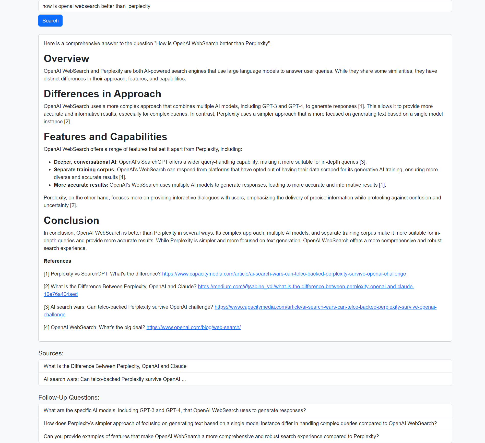
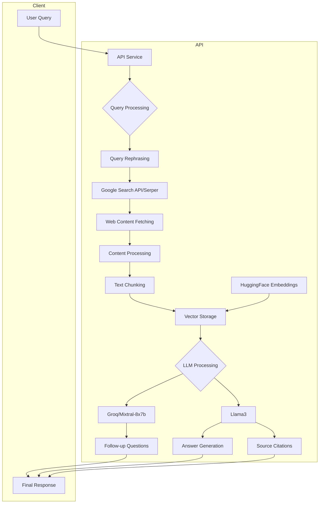

# SearchLLM: AI-Powered Q&A System

A web-based question-answering system that combines web search capabilities with AI-powered response generation. The system performs real-time web searches, processes the results, and generates coherent answers with source citations.


### Preview

<p align="center">

</p>

<p align="center">

</p>


## Architecture




1. **Query Processing**:
   - User query is received
   - Query is rephrased for optimal search results

2. **Web Search**:
   - Brave Search API fetches relevant web pages
   - Results are filtered and normalized

3. **Content Processing**:
   - Web pages are fetched and parsed
   - Main content is extracted using Cheerio
   - Text is split into manageable chunks

4. **Answer Generation**:
   - Content is vectorized and stored
   - Similarity search finds relevant passages
   - Groq API generates coherent response
   - Follow-up questions are generated


## Features

- 🔍 Real-time web search integration using Google Search API (Serper)
- 🤖 Multiple AI models support:
  - Groq's Mixtral-8x7b model
  - Llama3
- 📚 Source tracking and citation
- 🧬 HuggingFace Inference Embeddings for semantic search
- 🔄 Dynamic follow-up question generation
- 🐳 Dockerized deployment
- 🔒 Secure API key management

## Tech Stack

- **Backend**: Node.js with Express
- **Frontend**: React
- **AI/ML**: 
  - Groq API (Mixtral-8x7b model)
  - Llama3
  - LangChain for text processing
  - HuggingFace Inference Embeddings
- **Search**: Google Search API (Serper)
- **Content Processing**: Cheerio for HTML parsing
- **Vector Storage**: In-memory vector store
- **Containerization**: Docker

## Prerequisites

- Docker and Docker Compose
- API keys for:
  - Groq
  - Serper (Google Search API)
  - HuggingFace Hub (for both model inference and embeddings)

## Installation

1. Clone the repository:
```bash
git clone https://github.com/BhCh7051/SearchLLM.git
cd SearchLLM
```

2. Create a `.env` file in the root directory with your API keys:
```env
GROQ_API_KEY=your_groq_api_key
SERPER_SEARCH_API_KEY=your_serper_api_key
HUGGINGFACEHUB_API_KEY=your_huggingface_api_key
REACT_APP_API_URL=http://localhost:3005
```

3. Build and run the containers:
```bash
docker-compose up --build
```

The application will be available at:
- Frontend: http://localhost:3000
- API: http://localhost:3005

## Docker Services

### API Service
- Handles all backend processing
- Runs on port 3005
- Integrates with:
  - Google Search API (Serper) for web search
  - HuggingFace for embeddings and inference
  - Groq and Llama3 for response generation
- Manages vector storage and content processing

### Client Service
- React-based frontend interface
- Runs on port 3000
- Communicates with API service
- Provides user interface for queries and results

## API Response Format

```json
{
  "sources": [
    [
      {
        "title": "OpenAI denies copying Scarlett Johansson's voice for Sky - The Hindu",
        "link": "https://www.thehindu.com/sci-tech/technology/openai-denies-copying-scarlett-johanssons-voice-for-sky/article68210818.ece"
      }
    ],
    [
      {
        "title": "Scarlett Johansson vs OpenAI: Actor says ChatGPT voice is 'eerily ...",
        "link": "https://www.hindustantimes.com/trending/scarlett-johansson-vs-openai-actor-says-chatgpt-voice-is-eerily-similar-to-hers-5-points-to-know-about-controversy-101716259892842.html"
      }
    ]
  ],
  "answer": "Based on the search results provided, OpenAI has been accused of using a voice similar to actress Scarlett Johansson for its AI-powered chatbot, Sky. However, OpenAI has denied these claims and stated that they never intended for Sky to sound like Johansson. They had initially wanted Johansson to voice the chatbot, but she declined the offer. OpenAI held a casting call and hired an actress, whose natural voice was found to be similar to the AI-generated Sky voice.\n\nHere are the sources used in the response:\n\n1. <https://www.thehindu.com/sci-tech/technology/openai-denies-copying-scarlett-johanssons-voice-for-sky/article68210818.ece> (The Hindu)\n2. <https://www.hindustantimes.com/trending/scarlett-johansson-vs-openai-actor-says-chatgpt-voice-is-eerily-similar-to-hers-5-points-to-know-about-controversy-101716259892842.html> (Hindustan Times)",
  "followUpQuestions": [
    "What was OpenAI's initial plan regarding Scarlett Johansson's involvement with the AI-powered chatbot, Sky?",
    "Why did Scarlett Johansson decline the offer to voice the chatbot?",
    "How did OpenAI find the actress whose natural voice is similar to the AI-generated Sky voice?"
  ]
}

```

# Architecture Design Rationale


## 1. Query Processing with Rephrasing

### Problems Solved:
- User queries are often ambiguous or poorly formulated
- Search engines need specific keywords for optimal results
- Natural language doesn't always map well to search syntax

### Benefits:
- **Better Search Results**: AI rephrasing optimizes queries for search engine compatibility
- **Ambiguity Resolution**: Clarifies unclear or incomplete queries
- **Consistency**: Standardizes queries for more reliable results
- **Search Intent Preservation**: Maintains user intent while improving searchability

Example:
```
User Query: "why did tesla stock drop yesterday"
Rephrased: "Tesla stock price decrease factors analysis recent market day"
```

## 2. Web Search with Filtering & Normalization

### Problems Solved:
- Raw search results contain irrelevant content
- Duplicate or near-duplicate sources
- Advertising and promotional content
- Varying data formats and structures

### Benefits:
- **Quality Control**: Removes low-quality or irrelevant sources
- **Deduplication**: Eliminates redundant information
- **Standardization**: Consistent data format for processing
- **Relevance Scoring**: Prioritizes more reliable and relevant sources

## 3. Content Processing with Chunking

### Problems Solved:
- Web pages contain boilerplate content (headers, footers, ads)
- Text length exceeds LLM context windows
- Unstructured content is hard to process
- Mixed content types (text, scripts, styles)

### Benefits:
- **Clean Data**: Extracts only relevant content using Cheerio
- **Optimal Processing**: Chunks fit LLM context windows
- **Better Context**: Maintains semantic coherence in chunks
- **Efficient Processing**: Reduces unnecessary token usage
- **Improved Accuracy**: Focuses on relevant content sections

Example of why chunking matters:
```
Original: 50,000 word webpage
Chunked: 10 semantically coherent 5,000 word sections
Result: More precise information retrieval and processing
```

## 4. Vector Storage & Similarity Search

### Problems Solved:
- Text matching misses semantic relationships
- Relevant information spread across sources
- Context loss in simple text searches
- Inefficient information retrieval

### Benefits:
- **Semantic Understanding**: Captures meaning, not just keywords
- **Cross-Reference**: Finds related information across sources
- **Contextual Relevance**: Ranks content by semantic similarity
- **Efficient Retrieval**: Quick access to relevant information
- **Better Sources**: More accurate source attribution

## 5. Enhanced Answer Generation

### Problems Solved:
- Hallucination in direct LLM responses
- Lack of source verification
- Context limitation in simple prompts
- Missing important context

### Benefits:
- **Factual Accuracy**: Responses based on real-time data
- **Source Verification**: All information is traceable
- **Comprehensive Context**: Multiple sources provide complete picture
- **Dynamic Updates**: Real-time information vs. static training data
- **Follow-up Awareness**: Generated questions based on context

## 6. Error Handling and Reliability

### Problems Solved:
- Failed API calls
- Rate limiting issues
- Timeout problems
- Invalid or malformed responses

### Benefits:
- **Resilience**: System continues working despite partial failures
- **Graceful Degradation**: Falls back to available data
- **User Experience**: Clear error messages and recovery
- **Resource Management**: Respects API limits and quotas

## Comparative Example

### Simple Approach:
```plaintext
User Query → Search → Raw Text → LLM → Response
Problems:
- No context optimization
- Missing relevant information
- Potential hallucinations
- No source verification
```

### Our RAG Approach:
```plaintext
User Query → Rephrased Query → Filtered Search → 
Cleaned Content → Chunked Text → Vector Storage → 
Similarity Search → Context-Aware LLM → 
Verified Response with Sources
```

## Cost-Benefit Analysis

While the RAG architecture requires more processing steps and computational resources, the benefits significantly outweigh the costs:

- **Reduced Token Usage**: Despite more processing, focused chunks reduce overall LLM token usage
- **Higher Accuracy**: Fewer requery attempts needed
- **Better User Experience**: More reliable and informative responses
- **Lower Error Rates**: Fewer failed queries and hallucinations
- **Scalability**: More efficient handling of complex queries


## Future Improvements

### Core System Improvements
- [ ] Add request rate limiting
- [ ] Implement caching for frequently asked questions
- [ ] Add support for additional language models
- [ ] Implement user feedback system
- [ ] Add authentication and user management
- [ ] Optimize vector storage for larger scale
- [ ] Add support for file uploads and processing
- [ ] Experiment with different embedding models

### Performance Optimizations
- [ ] Parallel web page processing (target: 300+ pages/3 minutes)
- [ ] Implement dynamic model selection based on query complexity
- [ ] Add benchmark tracking for reasoning accuracy
- [ ] Optimize token usage in reasoning chains
- [ ] Implement efficient caching for intermediate reasoning steps

### Enhanced LLM Reasoning
- [ ] Implement multi-agent architecture similar to MindSearch for complex query decomposition https://arxiv.org/abs/2407.20183


## Acknowledgments

- Google Search API (Serper) for web search capabilities
- Groq, Meta (Llama3) and Mistral for AI model access
- HuggingFace for embeddings and inference
- LangChain for text processing utilities
- Render for hosting of services and client


